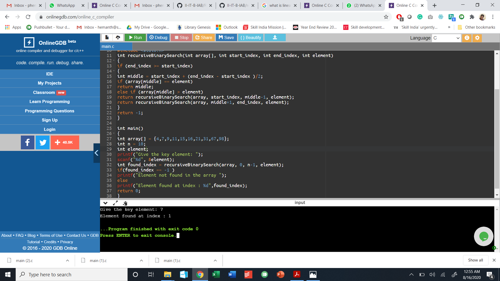

# Aim: Write a program that uses recursive function to perform binary search.

## Binary search looks for a particular item by comparing the middle most item of the collection. If a match occurs, then the index of item is returned. If the middle item is greater than the item, then the item is searched in the sub-array to the left of the middle item.

### step by step procedure:
### key element = 67

1. Read the number of array elements and the elements of the array.(here array = 4,7,9,11,15,16,21,31,67,98 n = 10)
2. The key element to be searched to be entered.(here it is 67 )
3. Find the middle element in the sorted list which is 15.
4. Compare the key element with the middle element in the sorted list and 67 is not equal to 15.
6. Both are not matched,the search element(67) is larger than the middle element.
8. The search element is larger than middle element so repeat steps 3, 4, 5 and 6 for the right sublist of the middle element.
9. The same process is repeated until we find the search element in the list or until sublist contains only one element..
11. In this case, it prints '67 is found at the index 8'

### key element = 7
1. Read the number of array elements and the elements of the array.(here array = 4,7,9,11,15,16,21,31,67,98 n = 10)
2. The key element to be searched to be entered.(here it is 7 )
3. Find the middle element in the sorted list which is 15.
4. Compare the key element with the middle element in the sorted list and 7 is not equal to 15.
6. Both are not matched,the search element(7) is smaller than the middle element.
8. The search element is smaller than middle element so repeat steps 3, 4, 5 and 6 for the left sublist of the middle element.
9. The same process is repeated until we find the search element in the list or until sublist contains only one element..
11. In this case, it prints '7 is found at the index 1'

### key element = 16
1. Read the number of array elements and the elements of the array.(here array = 4,7,9,11,15,16,21,31,67,98 n = 10)
2. The key element to be searched to be entered.(here it is 16)
3. Find the middle element in the sorted list which is 15.
4. Compare the key element with the middle element in the sorted list and 67 is not equal to 15.
6. Both are not matched,the search element(16) is larger than the middle element.
8. The search element is larger than middle element so repeat steps 3, 4, 5 and 6 for the right sublist of the middle element.
9. The same process is repeated until we find the search element in the list or until sublist contains only one element..
11. In this case, it prints '16 is found at the index 5'

